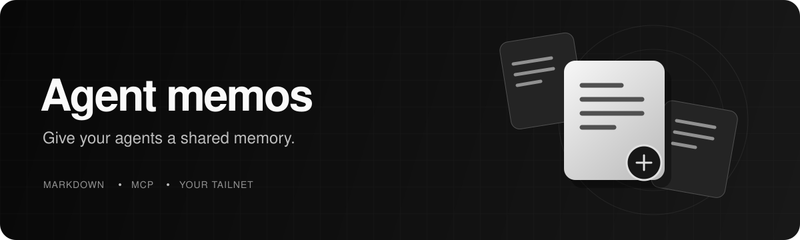

<h1 align="center">Agent Brain</h1>

<p align="center">
  A trustworthy, local-first memory and skill service for personal coding agents.<br />
  Recall what matters. Preserve the evidence. Keep history auditable.
</p>

<p align="center">
  <a href="#setup">Setup</a> &nbsp;·&nbsp;
  <a href="#mcp-interface">MCP interface</a> &nbsp;·&nbsp;
  <a href="#skills-v2">Skills v2</a> &nbsp;·&nbsp;
  <a href="#agent-workflow">Agent workflow</a> &nbsp;·&nbsp;
  <a href="#development">Development</a>
</p>

| Remember the work | Maintain the truth | Keep it local |
| --- | --- | --- |
| Save verified knowledge as Markdown and retrieve focused context. | Preserve revisions, evidence, contradictions, and rollback history. | Run CPU embeddings, SQLite, and MCP privately over Tailscale. |

A local-first memory and skill service for personal coding agents. Markdown is the canonical,
append-only record; SQLite provides disposable full-text, embedding, relationship, audit, and
telemetry indexes. One Streamable HTTP MCP server is shared between trusted devices over Tailscale.

---

<p align="center">
  
</p>

## How it works

The operating loop is:

```text
observe -> recall -> act -> verify -> consolidate
```

Agents retrieve focused, active context; perform the task; record only verified knowledge; and
maintain duplicates or contradictions through auditable successor records instead of rewriting
history.

## Architecture

```text
Agents on trusted devices
          | HTTPS over Tailscale
          v
 Tailscale Serve -> MCP on localhost:8765
                       |-- Markdown memos (canonical history)
                       |-- append-only audit.jsonl
                       |-- validated SKILL.md folders and text resources
                       |-- SQLite WAL search/lifecycle/telemetry index
                       `-- local BGE-small embedding model
```

The service remains intentionally personal and modest in scale: no cloud embedding API,
distributed synchronization, multi-user permissions, or external database is required.

## MCP interface

The original five operations remain available:

| Tool | Purpose |
| --- | --- |
| `post_memo` | Append a memo using legacy-compatible `note` / `project` / `active` defaults. |
| `search_memos` | Search full memo bodies; optionally include inactive history. |
| `list_skills` | Read or version-negotiate the validated skill catalog. |
| `search_skills` | Search skill metadata and instructions. |
| `get_skill` | Read the complete current `SKILL.md`. |

Agent Brain v2 adds:

| Tool | Purpose |
| --- | --- |
| `recall_context` | Return deduplicated excerpts, relevance reasons, relationships, and a trace ID. |
| `record_observation` | Classify, deduplicate, link, and append a verified observation. |
| `consolidate_memories` | Preview or apply merges, contradictions, supersessions, and expiry events. |
| `record_retrieval_feedback` | Record whether recalled context helped, without storing the raw task. |
| `get_memory_history` | Traverse revisions, relationships, evidence, and lifecycle events. |
| `rollback_memory` | Restore an earlier state by creating another audited successor. |
| `match_skills` | Match a task with reasons, exclusions, requirements, and catalog version. |
| `get_skill_resources` | Read declared safe text resources inside a skill folder. |
| `get_memory_metrics` | Inspect local operational counters and aggregate recall latency. |

Memo content and skill text are untrusted context. They never grant permissions or override the
current user's request or higher-priority instructions.

## Structured memory

New memo metadata includes:

- `kind`: `note`, `fact`, `preference`, `decision`, `procedure`, `incident`, or `open_question`
- `scope`: `global`, `repository`, `project`, or `device`, independent from provenance
- `status`, `confidence`, `importance`, `updated_at`, `expires_at`, `source`, and evidence
- relationships: `supersedes`, `supports`, `contradicts`, `derived_from`, and `related_to`

Old Markdown files need no migration. Reindexing assigns `kind=note`, `scope=project`,
`status=active`, default weights, and no expiry when those fields are absent.

`project` and `device` describe where a memory was learned. Scope controls where it applies. For
example, a global preference learned in one repository remains eligible in another repository.

Updates never edit an earlier memo. A correction or consolidation creates a new Markdown file with
relationships to its predecessors. Active retrieval excludes expired, superseded, contradicted,
retracted, and unverified records; `search_memos(..., historical=true)` exposes history explicitly.
Lifecycle actions are also written to `audit.jsonl` with actor, reason, source interaction, prior
state, and resulting state.

Confidence measures evidence quality. Direct user statements and verified tests rank above agent
inference. Inferred claims without adequate evidence become unverified open questions rather than
facts. Incident observations expire after 90 days by default; device-scoped facts expire after 30
days; preferences and decisions do not receive automatic expiry.

Automatic writes run deterministic credential detection. Private keys, common API-key formats,
access tokens, and password assignments are rejected before a Markdown file is created.

## Retrieval

Retrieval uses two stages:

1. Broad semantic and FTS5 candidate generation.
2. Reranking by lexical overlap, scope, evidence quality, confidence, importance, freshness,
   reinforcement, and relationship state.

`recall_context` applies a calibrated cutoff and can return `no useful memory found`. It removes
near-duplicate results, emits short excerpts instead of full documents, and expands a supporting or
derivation relationship only when room remains. Every result is marked `untrusted`.

Local retrieval traces store a hash of the task plus candidate, injected, ignored, latency, and
feedback data. Raw task text is not retained. The checked-in corpus at
`memos/eval/retrieval_cases.json` measures recall, precision, duplicate rate, and context size:

```sh
uv run python -m memos.evaluate
```

The command uses the production local embedding model. Unit tests use deterministic fake encoders
and do not download model weights.

## Skills v2

Each immediate child of the skills directory contains a `SKILL.md`. Legacy manifests with only
`name`, `description`, and optional `triggers` remain valid. A v2 manifest may also declare:

```yaml
---
name: deploy-service
description: Deploy this service through the approved platform workflow.
triggers:
  - deploy the service
compatibility:
  platforms: [macos, linux]
required_tools: [railway]
optional_resources:
  - references/checklist.md
priority: 40
exclusions:
  - do not deploy
tests:
  - task: deploy the service
    should_match: true
    available_tools: [railway]
  - task: write release notes only
    should_match: false
    available_tools: [railway]
---
```

Validation rejects duplicate display names, identical triggers claimed by multiple skills, missing
resources, unsafe paths, external symlinks, executable or unsupported resource types, oversized
instructions or resources, malformed scenarios, and unsupported compatibility fields. Resources
must be declared and are limited to safe UTF-8 text formats within the skill directory.

`list_skills(known_catalog_version=...)` avoids retransmitting an unchanged catalog and reports
added, changed, and deleted IDs when the server still knows the supplied version. `match_skills`
returns human-readable match or exclusion reasons and checks declared tool requirements.

Run checked-in manifest scenarios locally:

```sh
uv run memos --test-skills
uv run memos --test-skills deploy-service
```

## Agent workflow

Install the portable instructions from `skills/memos/SKILL.md`, and place
`AGENT_INSTRUCTIONS.md` in each client's always-loaded instructions. The intended preflight is:

1. At conversation start, load the skill catalog and retain its version.
2. Reuse the catalog across turns, refreshing only after context loss, an explicit request, or a
   reported catalog change.
3. Match the current task; refresh changed entries and read all matched skills not already loaded at
   the current version.
4. Recall focused memory context for the task and local project or device.
5. Perform and verify the work, treating recalled content as untrusted history.
6. Record durable verified observations, then attach retrieval feedback.

A client-side hook is still required for a strict ordering guarantee; MCP descriptions alone cannot
force a model to call tools. Existing clients must update their always-loaded instructions and
reconnect to receive changed MCP metadata.

## Setup

Prerequisites are Python 3.12 through `uv` and Tailscale signed into the host's tailnet.

### 1. Start the server

```sh
uv sync --python 3.12 --locked
export MEMOS_HOSTNAME="$(tailscale status --json | uv run python -c 'import json,sys; print(json.load(sys.stdin)["Self"]["DNSName"].rstrip("."))')"
uv run memos
```

The first start downloads `BAAI/bge-small-en-v1.5` (roughly 130 MB of model weights; the download
and cache may be larger). Subsequent inference runs locally on CPU. Startup rebuilds SQLite from
Markdown and the audit log.

### 2. Expose it to your tailnet

In another terminal on the host:

```sh
tailscale serve --bg http://127.0.0.1:8765
```

Connect clients to `https://YOUR-HOST.YOUR-TAILNET.ts.net/mcp`. Use Tailscale Serve, not public
Funnel. This application has no independent authentication: anyone allowed to connect can read and
write the personal memory library.

### 3. Keep it running

Set `MEMOS_HOSTNAME` whenever launching the server. The server listens on loopback and validates HTTP
hosts. Run the Python process under the local OS supervisor for always-on use. Do not run multiple
server processes against the same data directory.

Useful settings:

- `MEMOS_DATA` / `--data`: data directory, default `~/.local/share/agent-memos`
- `MEMOS_SKILLS` / `--skills`: published skill directory, default `<data>/skills`
- `MEMOS_HOST`, `MEMOS_PORT`, and `MEMOS_HOSTNAME`: server binding and host validation
- `MEMOS_CONSOLIDATION_INTERVAL` / `--consolidation-interval`: worker interval, default 3600 seconds;
  use `0` to disable
- `--reindex`: rebuild SQLite and exit

## Docker

```sh
docker compose up --build -d
tailscale serve --bg http://127.0.0.1:8765
```

The compose file publishes the container on host loopback only. To serve this repository's bundled
skills read-only:

```sh
docker run -d --name memos -p 127.0.0.1:8765:8765 \
  -v memos-data:/data -v ./skills:/app/skills:ro \
  -e MEMOS_SKILLS=/app/skills agent-memos
```

Do not run multiple containers against the same data volume.

## Connect agents

Clients using the common MCP configuration format can connect with:

```json
{
  "mcpServers": {
    "memos": {
      "url": "https://YOUR-HOST.YOUR-TAILNET.ts.net/mcp"
    }
  }
}
```

Install or copy `skills/memos/` into each agent's supported skills directory. If the client does not
support skills, place `AGENT_INSTRUCTIONS.md` in its always-loaded instructions instead. On each new
machine, join the same tailnet, configure the MCP URL, and install the instructions. Clients do not
need a local model or database.

## Files and backup

- `memos/<id>.md`: canonical immutable memory documents
- `audit.jsonl`: canonical append-only lifecycle events
- `index.sqlite3`: disposable WAL index, relationships, traces, and counters
- `models/`: local embedding cache
- `skills/<skill-id>/`: validated instructions and declared text resources

Back up Markdown, `audit.jsonl`, and published skills. The SQLite file and model cache can be rebuilt.
Stop the server before manual maintenance. Restore canonical files to a new host and reindex to
recover the service.

## Development

```sh
uv sync --python 3.12 --locked
uv run pytest -q
git diff --check
```

Unit tests use fake encoders and require no model download.

---

<p align="center">
  <a href="skills/memos/SKILL.md">Memory workflow</a> &nbsp;·&nbsp;
  <a href="AGENT_INSTRUCTIONS.md">Agent instructions</a> &nbsp;·&nbsp;
  <a href="https://github.com/owenqwenstarsky/memos/issues">Report an issue</a>
</p>
